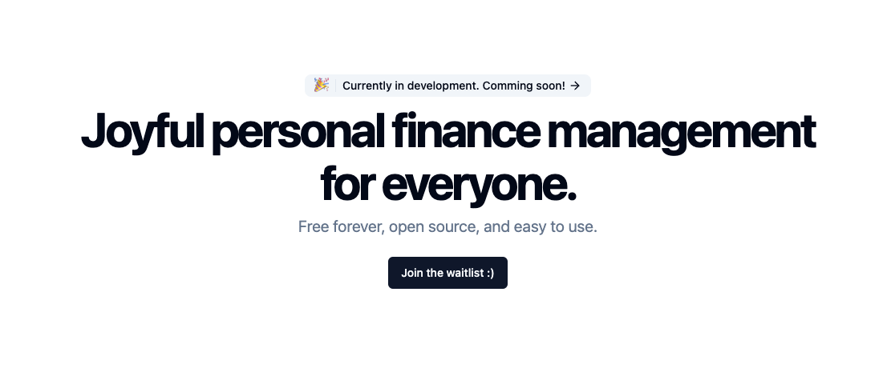

# Fijoy

<!-- ALL-CONTRIBUTORS-BADGE:START - Do not remove or modify this section -->


[](https://app.fossa.com/projects/git%2Bgithub.com%2Ffijoyapp%2Ffijoy?ref=badge_shield)

<!-- ALL-CONTRIBUTORS-BADGE:END -->

Joyful personal finance management for everyone.

**Looking for collaborators!** [https://discord.gg/HwZarY9Aas](https://discord.gg/HwZarY9Aas)



## Contributors

<!-- ALL-CONTRIBUTORS-LIST:START - Do not remove or modify this section -->
<!-- prettier-ignore-start -->
<!-- markdownlint-disable -->
<table>
  <tbody>
    <tr>
      <td align="center" valign="top" width="14.28%"><a href="http://jyu.dev"><br /><sub><b>Joey Yu</b></sub></a><br /><a href="https://github.com/fijoyapp/fijoy/commits?author=itsjoeoui" title="Code">💻</a> <a href="https://github.com/fijoyapp/fijoy/commits?author=itsjoeoui" title="Documentation">📖</a></td>
      <td align="center" valign="top" width="14.28%"><a href="http://akwan.my.id"><br /><sub><b>Akwan Maroso</b></sub></a><br /><a href="https://github.com/fijoyapp/fijoy/commits?author=akwanmaroso" title="Code">💻</a></td>
      <td align="center" valign="top" width="14.28%"><a href="http://cs.mcgill.ca/~szhang139"><br /><sub><b>Sam Zhang</b></sub></a><br /><a href="https://github.com/fijoyapp/fijoy/commits?author=SamZhang02" title="Code">💻</a></td>
      <td align="center" valign="top" width="14.28%"><a href="https://github.com/hanzili"><br /><sub><b>hanzi</b></sub></a><br /><a href="https://github.com/fijoyapp/fijoy/commits?author=hanzili" title="Code">💻</a></td>
    </tr>
  </tbody>
</table>

<!-- markdownlint-restore -->
<!-- prettier-ignore-end -->

<!-- ALL-CONTRIBUTORS-LIST:END -->
<!-- prettier-ignore-start -->
<!-- markdownlint-disable -->

<!-- markdownlint-restore -->
<!-- prettier-ignore-end -->

<!-- ALL-CONTRIBUTORS-LIST:END -->

## Contribution

Make sure you have [Just](https://github.com/casey/just) installed to run just commands.
And do a quick `just init` to grab all the dependencies.

The next step is to setup all the environment variables.

You can find more details in `apps/server/.env.example` and
`apps/web/.env.example`.

### Proto

We use protobuf to define the API for the server and the web.
To generate all the necessary code, run the following commands:

```bash
just buf
```

### Server

We are using [Jet](https://github.com/go-jet/jet) to generate DB related stuff for
a type-safe query building experience.

```bash
just jet
```

### Database

All database migrations are in `apps/server/internal/database/migrations`.
Here are all the migration commands:

```bash
just db-up
just db-down
just db-force <version>
```

To start a local Postgres instance with Docker, you can use:

```bash
just postgres
```

### Web

[Kanel](https://kristiandupont.github.io/kanel/) is used to generate all the
TypeScript types and [Zod](https://zod.dev/) schemas from Postgres schemas on
a live Postgres database instance. It will use the `DB_URL` from `apps/server/.env`.

```bash
just kanel
```

### Test

This will run all the tests for the server and the web.

```bash
just test
```

---

To run the project, simply use `just dev`.


## License
[](https://app.fossa.com/projects/git%2Bgithub.com%2Ffijoyapp%2Ffijoy?ref=badge_large)